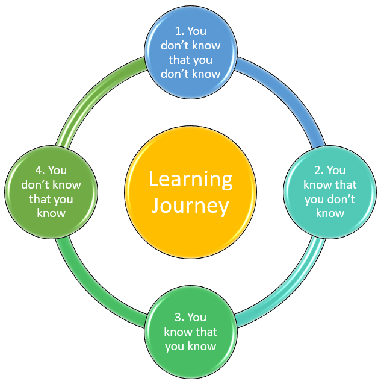
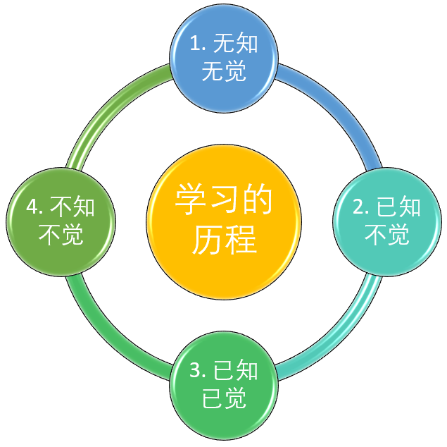

# 4 phases of learning

When people start to enter into one new field, or want to keep growth in the existing environment, one thing will be never wrong is the keep getting new things to learn.

In Chinese saying, it's "活到老，学到老", means "keep learning as long as you're alive".

With my years self experience, I'm strongly agree the learning journey is running in below 4 stages, and keep recurring when you reach the higher level and gain new experience.

## In English, they are

1. You don't know that you don't know

2. You know that you don't know

3. You know that you know

4. You don't know that you know

## In Chinese, they are

1. 无知无觉（不知道自己不知道，混沌懵懂）

2. 已知不觉（知道自己不知道）

3. 已知已觉（知道自己知道）

4. 不知不觉（运用自如，游刃有余）

 

### 一、无知无觉，尚未学习。

此时，人处于混沌无知中。像幼稚的儿童，无知无觉、无忧无虑。对于需要学习的东西一无所知，毫无兴趣，当然也没有开始学习。  

用另一句话概括叫：不知道自己不知道。  

### 二、已知不觉，正在学习。

此时，人已认识到自己的无知，已知道应该学习新东西。并开始学习，只是还未学会。这个阶段很难过，很苦恼！因为适应新东西要花费相当的心力。人都有自己的舒适区，改变会让人不舒爽、失去兴趣，甚至对抗、逃避。日常常见一些人陷入紧张、苦恼、忧郁，其多半处于此阶段。正像一个青年人身处烦恼中慨叹：像童年时快活多好！其实，童年的快活往往等于无知，青年的烦恼正预示了成长。该沮丧或庆贺？惟在自己心理一端。在这成长的阵痛期，只要坚持下去，很快会上升到更好的阶段。  

此阶段用另一句话概括：知道自己不知道。  

### 三、已知已觉，已经学会。

此时，人对于要学习的东西已经学会，而且越来越熟练、越来越有感觉。这时心里逐渐开朗，重新提起兴趣，并在“胜利在望”的吸引下，更加勤奋的学习。  

用另一句话概括：知道自己知道。  

### 四、不知不觉，运用自如。

此时，人对学习的新东西已炉火纯青、得心应手。运用起来，成了再自然不过的事。就像已经融入身体、融入本性，已不需要运用理智或头脑去指挥，完全成了本能的反应。就像乔丹打篮球、朗郎弹钢琴--如行云流水，如呼吸一般自然、流畅。  

用另一句话概括：不知道自己知道（即忘我状态）。  

Enjoy...
