# Build "US NSS" into Graph

- [Build "US NSS" into Graph](#build-us-nss-into-graph)
  - [Purpose](#purpose)
  - [Preparation](#preparation)
  - [Load into Graph](#load-into-graph)
    - [Create New `Regulation` Node](#create-new-regulation-node)
    - [Create Level 1 `Content` and Link to Regulation](#create-level-1-content-and-link-to-regulation)
    - [Create Level 2 `Content` and Link to Level 1](#create-level-2-content-and-link-to-level-1)
    - [Create Level 3 `Content` and Link to Level 2](#create-level-3-content-and-link-to-level-2)
    - [Create Level 4 `Content` and Link to Level 3](#create-level-4-content-and-link-to-level-3)
    - [Create Level 5 `Content` and Link to Level 4](#create-level-5-content-and-link-to-level-4)
    - [Create Level 6 `Content` and Link to Level 5](#create-level-6-content-and-link-to-level-5)
  - [Query from the Graph](#query-from-the-graph)
    - [Load Complete Article](#load-complete-article)
    - [Query any contents have certain keyword](#query-any-contents-have-certain-keyword)
  - [Add Chinese Translated Content](#add-chinese-translated-content)
    - [在中文语境下进行关键字查询](#在中文语境下进行关键字查询)

## Purpose

This document shows how to build graph of the "US National Security Strategy - November 2025" as one `Regulation` article.

The source for read the issued article is here: https://www.whitehouse.gov/issues/national-security/

After loading into graph, there will be possibility to retrieve some interested keywords and create certain relevant categories for further analysis.

And, the node `Regulation` is used for keep adding more variable regulations & laws so that later the cross benchmarking analysis can be expected.

## Preparation

The CSV (with 6 levels) - [US_National_Security_Strategy.csv](./US_National_Security_Strategy.csv) - is created base on the Excel file.

## Load into Graph

Current graph is called `regulations` under Neo4j 2.x's `Practice` local instance.

### Create New `Regulation` Node

```cypher
MERGE (n:Regulation {title: "National Security Strategy of the United States of America, November 2025", releasedAt: "November 2025", country: "US", language: "English"})
RETURN n
```

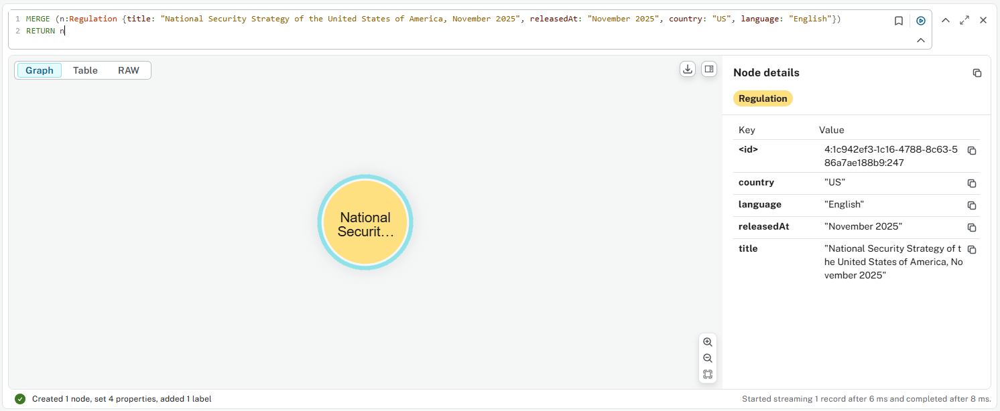

### Create Level 1 `Content` and Link to Regulation

```cypher
LOAD CSV WITH HEADERS FROM "file:///D://GitHub//info_zone//articles//US//US_National_Security_Strategy.csv" as row
MATCH (r:Regulation {title:"National Security Strategy of the United States of America, November 2025"})
MERGE (c1:Content {title:row.Level1})
MERGE (r)-[c:CONTAINS]->(c1)
RETURN r, c1, c
```

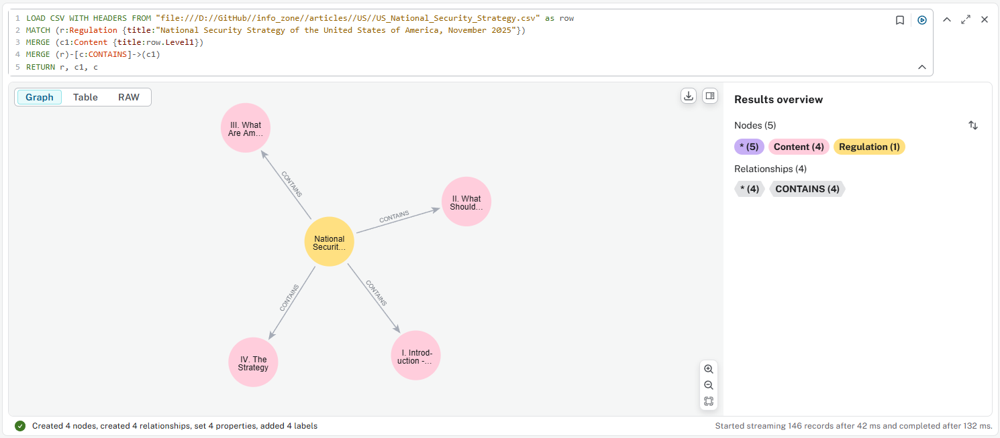

Note: build one level per level because there would have empty lines in some branches, this is the easy way for creating correct hierarchy

### Create Level 2 `Content` and Link to Level 1

```cypher
LOAD CSV WITH HEADERS FROM "file:///D://GitHub//info_zone//articles//US//US_National_Security_Strategy.csv" as row
MATCH (c1:Content)
WHERE c1.title = row.Level1 AND row.Level2 IS NOT NULL
MERGE (c2:Content {title:row.Level2})
MERGE (c1)-[c:CONTAINS]->(c2)
RETURN c1, c2, c
```

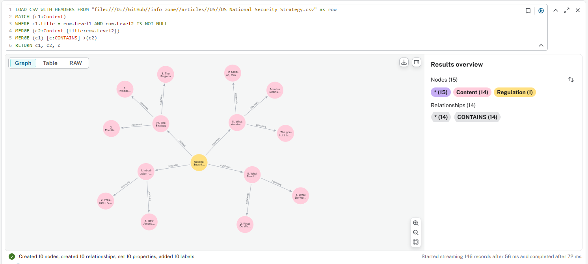

### Create Level 3 `Content` and Link to Level 2

```cypher
LOAD CSV WITH HEADERS FROM "file:///D://GitHub//info_zone//articles//US//US_National_Security_Strategy.csv" as row
MATCH (c2:Content)
WHERE c2.title = row.Level2 AND row.Level2 IS NOT NULL AND row.Level3 IS NOT NULL
MERGE (c3:Content {title:row.Level3})
MERGE (c2)-[c:CONTAINS]->(c3)
RETURN c2, c3, c
```

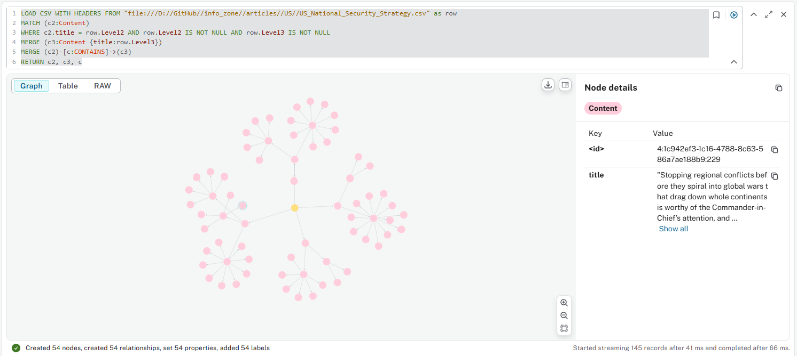


### Create Level 4 `Content` and Link to Level 3

```cypher
LOAD CSV WITH HEADERS FROM "file:///D://GitHub//info_zone//articles//US//US_National_Security_Strategy.csv" as row
MATCH (c3:Content)
WHERE c3.title = row.Level3 AND row.Level3 IS NOT NULL AND row.Level4 IS NOT NULL
MERGE (c4:Content {title:row.Level4})
MERGE (c3)-[c:CONTAINS]->(c4)
RETURN c3, c4, c
```

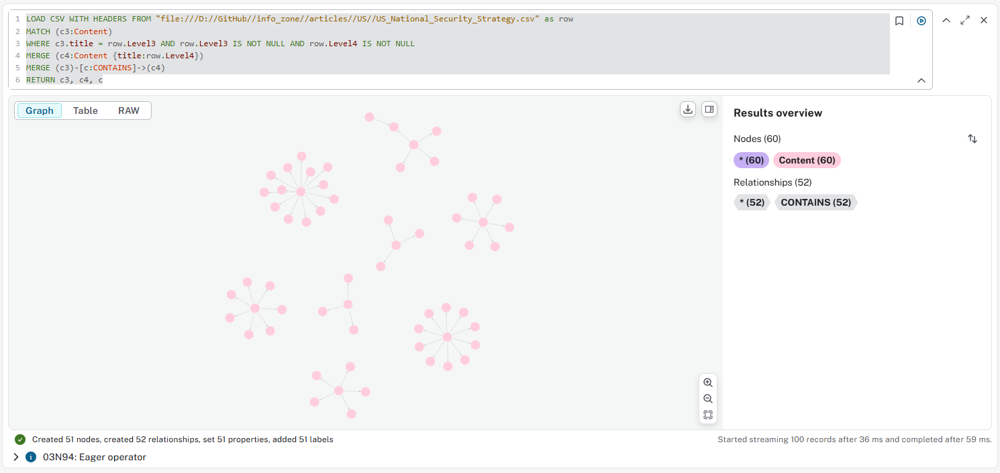

### Create Level 5 `Content` and Link to Level 4

```cypher
LOAD CSV WITH HEADERS FROM "file:///D://GitHub//info_zone//articles//US//US_National_Security_Strategy.csv" as row
MATCH (c4:Content)
WHERE c4.title = row.Level4 AND row.Level4 IS NOT NULL AND row.Level5 IS NOT NULL
MERGE (c5:Content {title:row.Level5})
MERGE (c4)-[c:CONTAINS]->(c5)
RETURN c4, c5, c
```

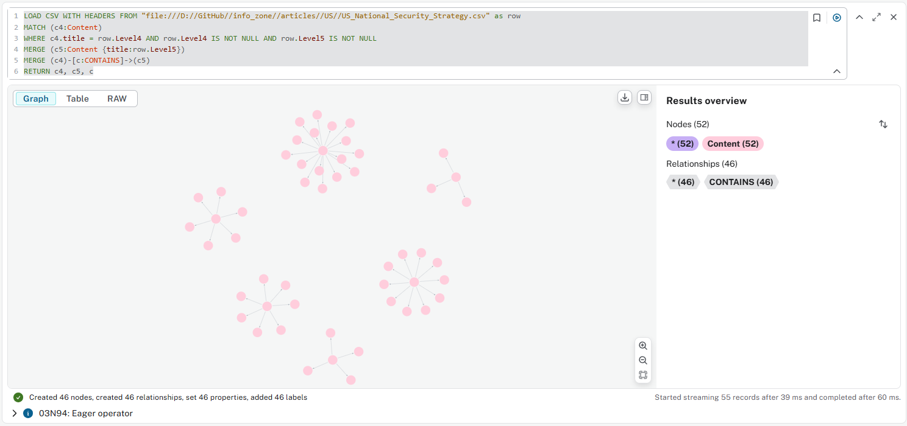

### Create Level 6 `Content` and Link to Level 5

```cypher
LOAD CSV WITH HEADERS FROM "file:///D://GitHub//info_zone//articles//US//US_National_Security_Strategy.csv" as row
MATCH (c5:Content)
WHERE c5.title = row.Level5 AND row.Level5 IS NOT NULL AND row.Level6 IS NOT NULL
MERGE (c6:Content {title:row.Level6})
MERGE (c5)-[c:CONTAINS]->(c6)
RETURN c5, c6, c
```

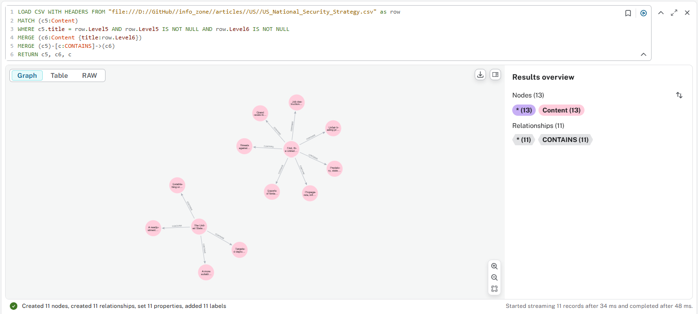

## Query from the Graph

### Load Complete Article

```cypher
MATCH (r:Regulation {title:
"National Security Strategy of the United States of America, November 2025"})-[i:CONTAINS*]->(c:Content)
RETURN r,i,c
```

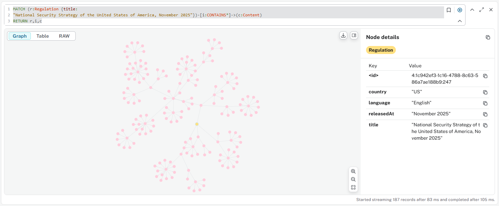

### Query any contents have certain keyword

e.g. "Technology"

```cypher
MATCH (n:Content)
MATCH (r:Regulation {title:
"National Security Strategy of the United States of America, November 2025"})-[i:CONTAINS*]->(c:Content)
MATCH (n)-[c1:CONTAINS*]->(c)
WHERE toLower(c.title) CONTAINS "technology"
RETURN c,c1,n
```

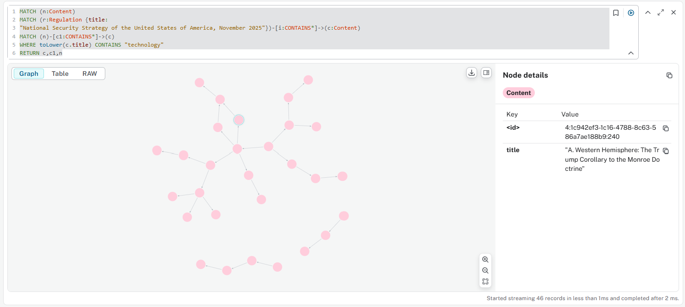

## Add Chinese Translated Content

Following query to load the new CSV with Chinese translated contents in another 6 columns, run it 6 times while changing the # of Level:

```cypher
LOAD CSV WITH HEADERS FROM "file:///D://GitHub//info_zone//articles//US//US_National_Security_Strategy_Nov2025//US_National_Security_Strategy_bilingual.csv" as row
MATCH (a:Content)
WHERE a.title = row.Level6
MERGE (c:Content {title: row.`Level6`})
SET c.titleChinese = row.Level6CN
RETURN c
```

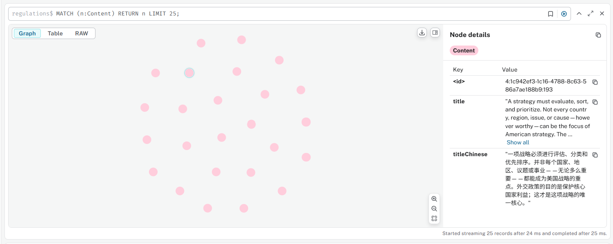

### 在中文语境下进行关键字查询

```cypher
MATCH (n:Content)
MATCH (r:Regulation {title:
"National Security Strategy of the United States of America, November 2025"})-[i:CONTAINS*]->(c:Content)
MATCH (n)-[c1:CONTAINS*]->(c)
WHERE c.titleChinese CONTAINS "中国"
RETURN c,c1,n
```

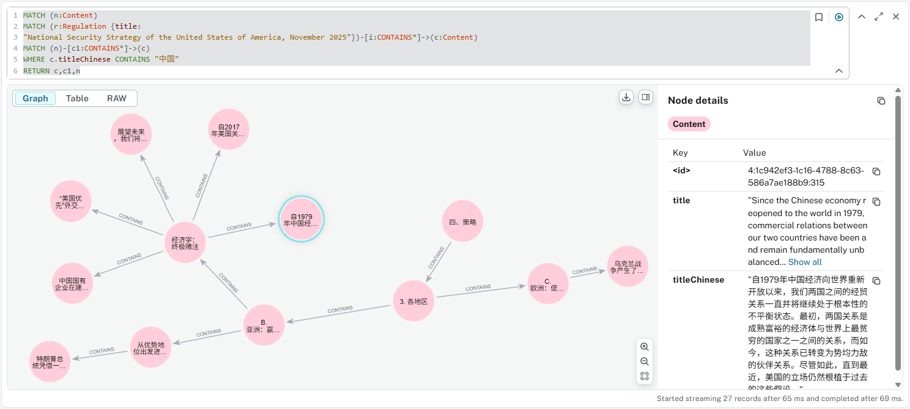

---

Last Updated at 12/22/2025, ©Xiaoqi Zhao, 2025, All Rights Reserved.