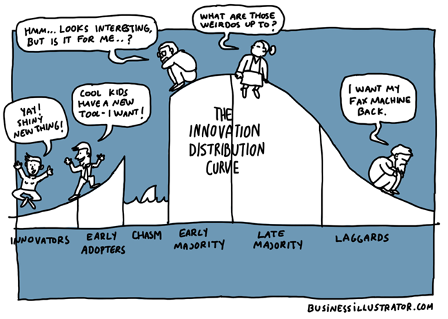
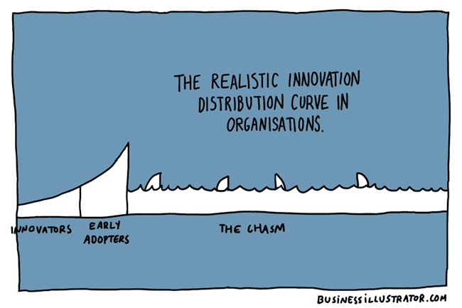
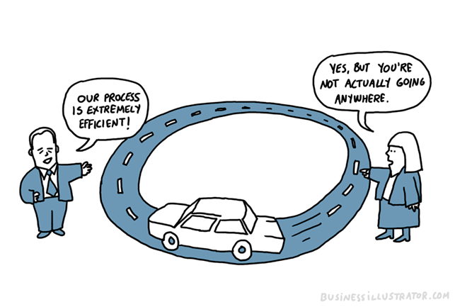

# CARTOONS Collection 发人深思的卡通漫画

[TOC]

These caroons are from [business illustrator](https://www.businessillustrator.com)
They're not only interesting themselves, but also, more important, telling deeper principles and touching the backend of the truth!

## The realistic innovation distribution curve 现实中的创新氛围分配曲线 2017/10/31 [Link](https://www.businessillustrator.com/innovation-distribution-curve-cartoon/)

  

We’ve all seen the innovation distribution curve (above). But those banging their heads on involved in organisational change efforts might sometimes feel that the word “chasm” doesn’t quite describe the challenge you are facing…

  

## Leadership vs management 2017/10/31 [link](https://www.businessillustrator.com/leadership-vs-management/)

What exactly is the difference between leadership and management? One way to differentiate the two concepts is the kind of questions managers and leaders are expected to ask. A managerial mindset is often associated with maintaining processes, a leadership mindset is more about asking the right questions.

> Virpi @voinonen

## It’s hard to survive in the jungle when you were trained in a zoo 2017/10/31 [Link](https://www.businessillustrator.com/its-hard-to-survive-in-the-jungle-when-you-were-trained-in-a-zoo-cartoon/)

  

Were you trained in a zoo? You probably were. I know I was.

I came across a blog post on the metaphor of zoos and jungles by management consultant Sonja Blignaut. It nicely contrasts the mindset in an industrial era hierarchical organisation and a more modern, networked organisation. The former assumes a predictable and neatly organised world – senior managers focus on long term predictions and central planning. The latter assumes a chaotic world where agile experimentation has become a key way to figure out what to do and how to do it.

It’s scary for zoo folk to suddenly unlearn former certainties and ways of doing things.

** Metaphors + storytelling = sticky messaging **

Sonja is a big fan of metaphors in organisational change context – this is just one of them. She told me she is building a bank of metaphors and will put on her website at some point – definitely something I would find useful as I spend quite a lot of time finding appropriate visual metaphors when turning strategies/reports/concepts into visual stories.

Metaphors together with storytelling help ideas stick more effectively than diagrams or talking heads.

> Virpi @voinonen
